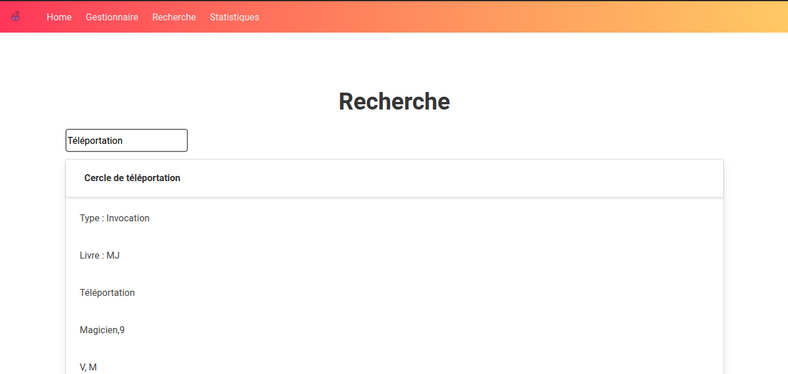

# Bibliot'ENSSAT

## Authors

Lou Le Gall and Maxime Cordier

## Description
Welcome to the MAGIC library of ENSSAT!
Here, you can search for a magic spell, view the statistics, or manage the spells.

## Technologies
- Langages : `JavaScript`, `HTML`, `CSS`
- Framework : `Vue.js` (version 2)
- Routage : `vue-router`
- UI / styles : `Bootstrap`, `Bulma`
- Build : `Webpack` (version 3), `Babel`, `PostCSS`
- Package manager : `npm`

## Build Setup

``` bash
# install dependencies
npm install

# serve with hot reload at localhost:8080
npm run dev

# build for production with minification
npm run build

# build for production and view the bundle analyzer report
npm run build --report
```

## Capture d'écran




For a detailed explanation on how things work, check out the [guide](http://vuejs-templates.github.io/webpack/) and [docs for vue-loader](http://vuejs.github.io/vue-loader).

